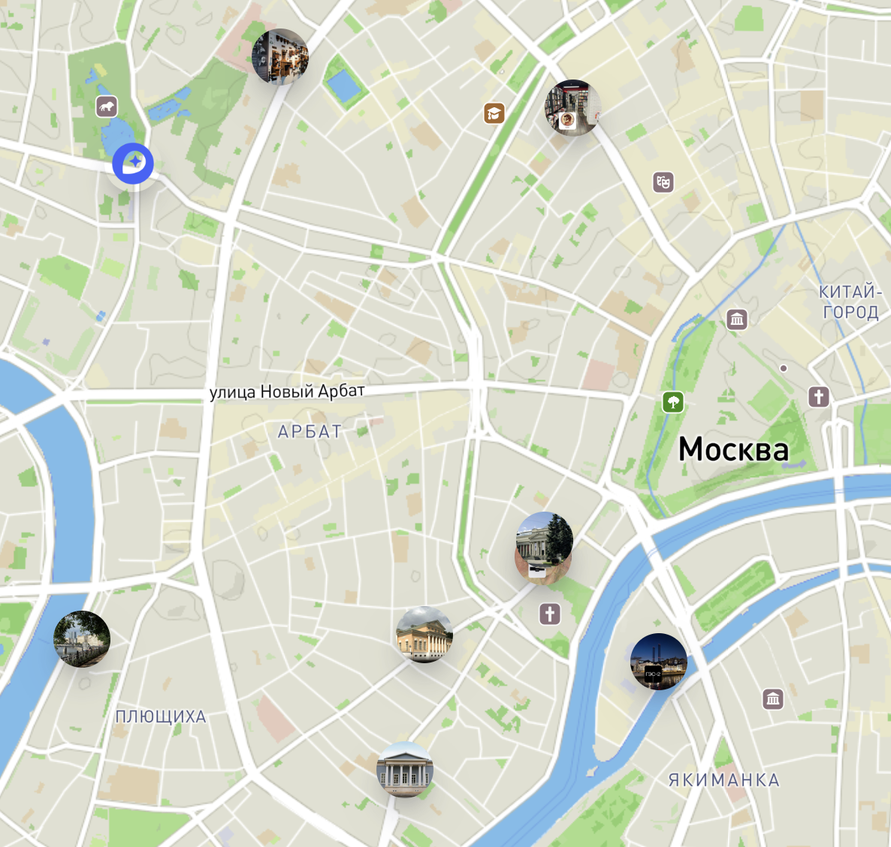

 [🚀 Home Page](https://andrewalevin.github.io/maps/) &ensp;  [🏰 Repository](https://github.com/andrewalevin/andrewalevin.github.io/maps/) &ensp;  [🔨 Edit Page](https://github.com/andrewalevin/maps/edit/main/README.md))

# 🗺️ Maps

### 🗺️ My Moscow Map

- [moscow/](moscow/)

### 🗺️ ☕️ My Cofeshops Moscow Map

- [moscow-cofeshops/](moscow-cofeshops/)

### Dev

Img

- [dev/query-terrain-elevation](dev/query-terrain-elevation)
